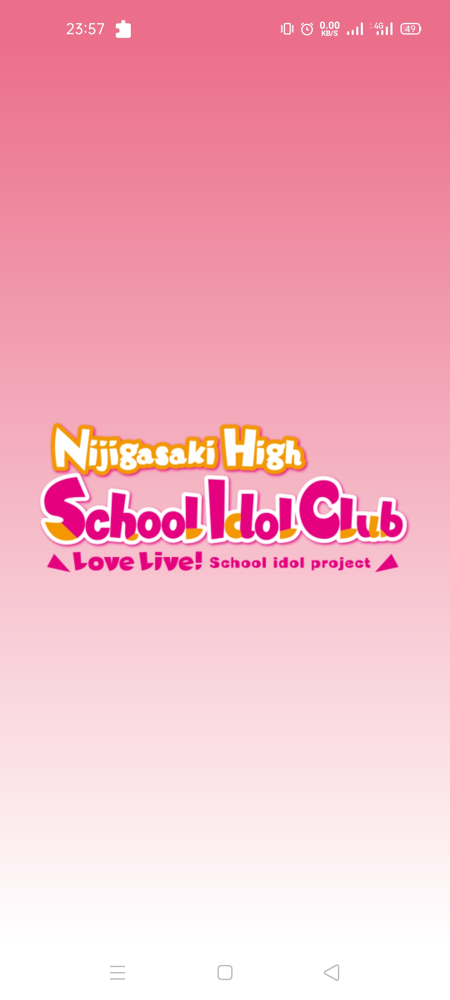
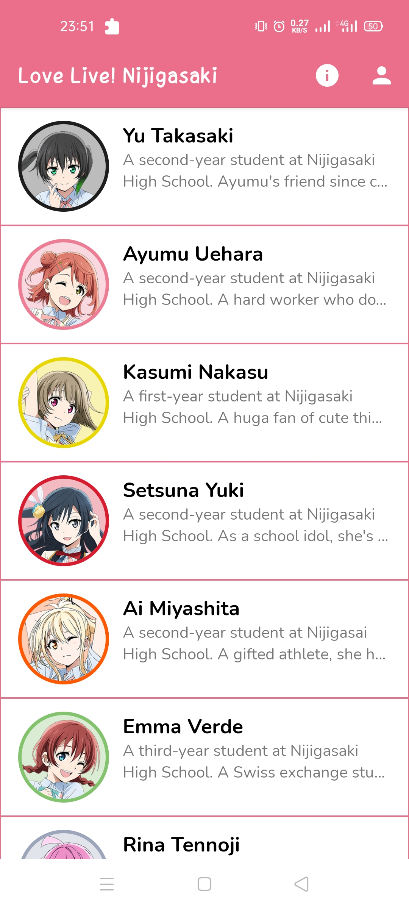
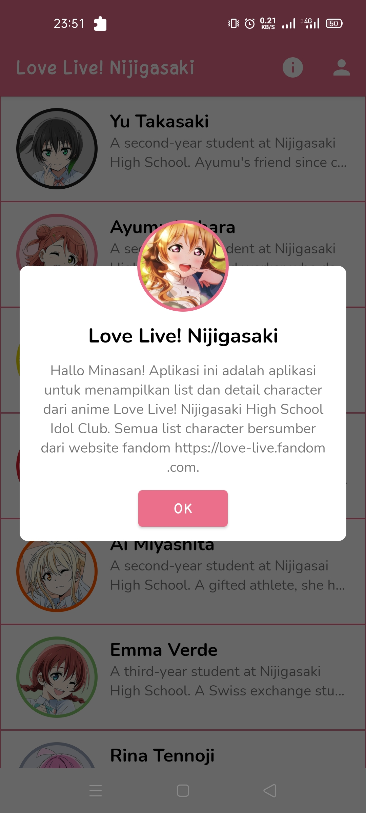
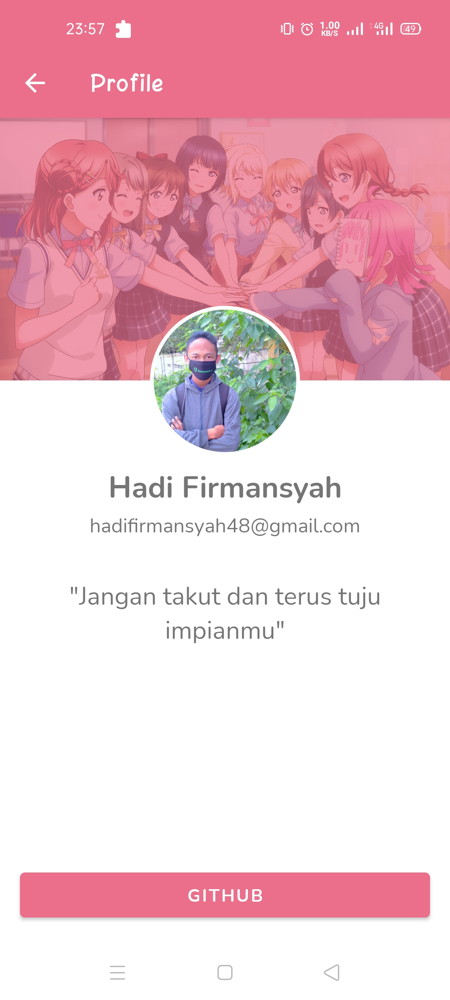
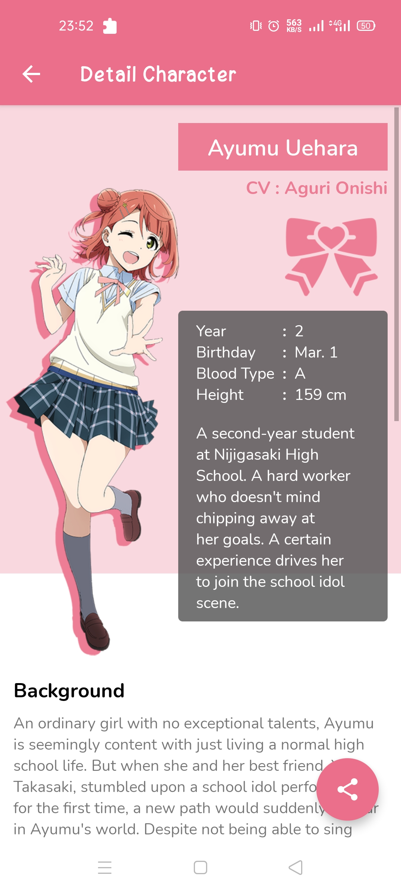
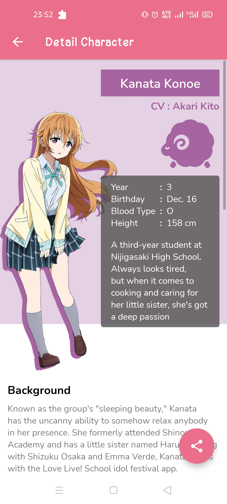
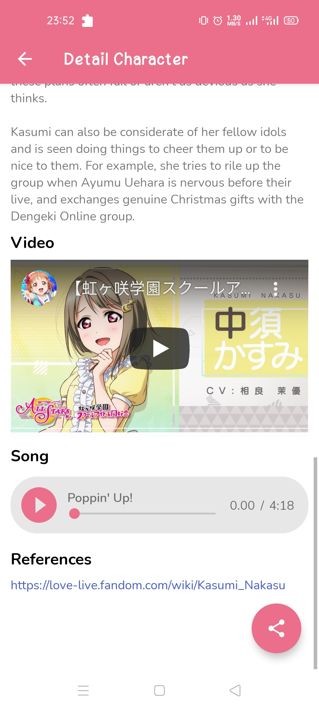

# Dicoding Submission Android Pemula - Love Live
[](http://developer.android.com/index.html) [](http://kotlinlang.org)

Submission Proyek Akhir Dicoding Membuat Aplikasi Sederhana - [Belajar Membuat Aplikasi Android untuk Pemula](https://www.dicoding.com/academies/51)
## Screenshots
&nbsp;&nbsp;&nbsp;
&nbsp;&nbsp;&nbsp;
&nbsp;&nbsp;&nbsp;


   
    
    
    
        
## Feature :
#### Submission Checklists
- [x] Menampilkan informasi dan gambar dalam format list
- [x] Halaman detail muncul saat item diklik
- [x] Menampilkan informasi yang relevan saat item diklik
- [x] Menampilkan Halaman Profile
- [x] Penambahan Webview pada halaman detail
- [x] Penambahan Media Player pada halaman detail
- [x] Button Share

## Installation
Clone this repository and import into Android Studio
```
https://github.com/hadi4642/Dicoding-Submission-Android-Love-Live.git
```

## Author
* #### Hadi Firmansyah
